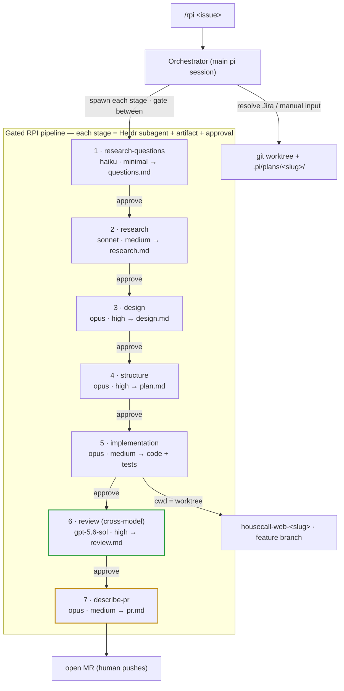

# pi-rpi-workflow

A gated **Research → Plan → Implement** pipeline for the [pi coding agent](https://github.com/earendil-works/pi), inspired by HumanLayer's RPI flow.

Turns an issue (Jira key or pasted text) into a reviewed MR through seven stages, each running as a visible [Herdr](https://herdr.dev) subagent that writes an artifact and **stops for human approval** before the next stage. Stage 6 is an **independent cross-model review** (`gpt-5.6-sol`) — a different model family from the one that designed and implemented the change, so it catches correlated blind spots and red-teams the CAB answers.

Each `→` is a human approval gate. Implementation runs in an isolated git worktree on a feature branch.

Production-change review (**PL-CAB / PCM**) is threaded through the pipeline rather than bolted on at the end: the four CAB questions (risk, works-in-prod, goes-wrong, rollback) are raised in stage 1, grounded with real monitors / feature-flags / killswitch facts in stage 2, designed in (incl. staged-rollout abort criteria) in stage 3, red-teamed against the real diff by the cross-model review in stage 6, and emitted as a ready-to-paste **`### CAB Review`** block in stage 7's `pr.md`. See [PL-CAB / PCM built in](#pl-cab--pcm-built-in).



## PL-CAB / PCM built in

The pipeline produces the answers a production-change review expects, from facts gathered along the way instead of guesses written at the finish line. Every change's Jira ticket must answer four questions, so each stage does part of the work:

| Stage | CAB/PCM contribution |
|---|---|
| 1 · research-questions | Raises a **Rollout & CAB (PCM)** question group mapping to the four questions |
| 2 · research | Gathers existing monitors/alerts, dashboards, Sentry ownership, feature-flag/killswitch, blast radius; flags gaps |
| 3 · design | Designs rollout / observability / rollback **in** — killswitch, which alert catches a regression, staged-rollout abort criteria |
| 6 · review | **Red-teams** the four answers against the real diff (honest risk, real signal, named alert, safe rollback) — different model family |
| 7 · describe-pr | Emits `### Rollout` + `### CAB Review` blocks answering all four, with a quality bar for the common rejections |

**The four questions** (put these in the **Jira ticket description** — the source of truth for CAB; the MR copy and ASF bot are advisory):

1. **Risk level and why?** (Low / Medium / High)
2. **How will you know it works correctly in production?**
3. **How will you know if something goes wrong?**
4. **What's your rollback / revert plan?**

"N/A" is a valid answer when genuinely true (e.g. spec-only change) — just say so explicitly. The bar: *a reviewer who doesn't know your domain can understand the risk.*

> The CAB wording embeds HCP's [PL CAB approval process](https://housecall.atlassian.net/wiki/spaces/ENG/pages/4432592978/) and [CAB Review — Frequent Feedback](https://housecall.atlassian.net/wiki/spaces/ENG/pages/4468637769/). Adapt or drop it if your org has a different change-management process.

## Requirements

- pi coding agent
- [`pi-herdr-subagents`](https://www.npmjs.com/package/pi-herdr-subagents) — spawns each stage as a Herdr tab
- Running inside Herdr (for visible stage panes)
- Optional: `@plannotator/pi-extension` for browser annotate gates; Atlassian MCP for Jira issue resolution and CAB-doc lookups

## Install

```bash
git clone <this-repo> pi-rpi-workflow
cd pi-rpi-workflow
./install.sh          # symlinks agents + prompt into ~/.pi/agent, copies example config
```

Then restart pi inside a Herdr pane. Run:

```
/rpi PRR-1234          # from a Jira key
/rpi <paste issue text>
```

## What it installs

| Path | What |
|---|---|
| `~/.pi/agent/agents/{research-questions,research,design,structure,implementation,review,describe-pr}.md` | The seven stage agents (model/effort tuned per stage) |
| `~/.pi/agent/prompts/rpi.md` | The `/rpi` orchestrator command |
| `~/.pi/agent/extensions/subagent/config.json` | Per-agent model routing (from the example, if you don't already have one) |

## Model routing (edit to taste)

| Stage | Model | Thinking |
|---|---|---|
| research-questions | haiku-4-5 | minimal |
| research | sonnet-4-6 | medium |
| design | opus-4-8 | high |
| structure | opus-4-8 | high |
| implementation | opus-4-8 | medium |
| review (cross-model) | gpt-5.6-sol | high |
| describe-pr | opus-4-8 | medium |

Change per-agent via the `model:`/`thinking:` frontmatter in each `agents/*.md`, or globally in `config/subagent-config.example.json`.

## Notes

- The stage agents embed repo guardrails as an example (feature branch, Public APIs, migrations in their own MR). Adapt the `## Constraints` sections in each agent to your codebase's rules (or your `AGENTS.md`).
- Gates are enforced by the orchestrator: one stage per turn, and it stops for your `go`. Nothing chains automatically.
- **Cross-model review is deliberate.** The rule is one model family writes, a *different* family reviews — that's what makes the review independent. Default is opus writes (stage 5) → `gpt-5.6-sol` reviews (stage 6). To lean on sol's coding strength instead, flip them (sol writes, opus reviews) — same structure, just swap the two `model:` values. Don't set both to the same family. The review stage needs an authenticated `openai-codex/gpt-5.6-sol`; swap it in `agents/review.md` / the config if you don't have access.

## License

MIT
