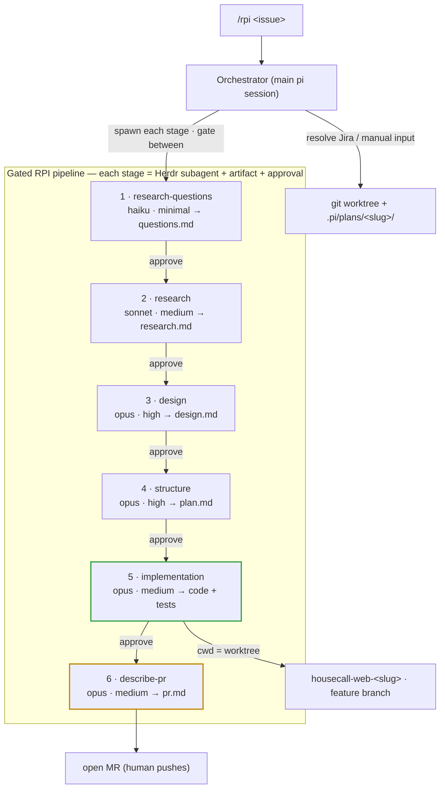

# pi-rpi-workflow

A gated **Research → Plan → Implement** pipeline for the [pi coding agent](https://github.com/earendil-works/pi), inspired by HumanLayer's RPI flow.

Turns an issue (Jira key or pasted text) into a reviewed MR through six stages, each running as a visible [Herdr](https://herdr.dev) subagent that writes an artifact and **stops for human approval** before the next stage.

Each `→` is a human approval gate. Implementation runs in an isolated git worktree on a feature branch.



## Requirements

- pi coding agent
- [`pi-herdr-subagents`](https://www.npmjs.com/package/pi-herdr-subagents) — spawns each stage as a Herdr tab
- Running inside Herdr (for visible stage panes)
- Optional: `@plannotator/pi-extension` for browser annotate gates; Atlassian MCP for Jira issue resolution

## Install

```bash
git clone <this-repo> pi-rpi-workflow
cd pi-rpi-workflow
./install.sh          # symlinks agents + prompt into ~/.pi/agent, copies example config
```

Then restart pi inside a Herdr pane. Run:

```
/rpi PRR-1234          # from a Jira key
/rpi <paste issue text>
```

## What it installs

| Path | What |
|---|---|
| `~/.pi/agent/agents/{research-questions,research,design,structure,implementation,describe-pr}.md` | The six stage agents (model/effort tuned per stage) |
| `~/.pi/agent/prompts/rpi.md` | The `/rpi` orchestrator command |
| `~/.pi/agent/extensions/subagent/config.json` | Per-agent model routing (from the example, if you don't already have one) |

## Model routing (edit to taste)

| Stage | Model | Thinking |
|---|---|---|
| research-questions | haiku-4-5 | minimal |
| research | sonnet-4-6 | medium |
| design | opus-4-8 | high |
| structure | opus-4-8 | high |
| implementation | opus-4-8 | medium |
| describe-pr | opus-4-8 | medium |

Change per-agent via the `model:`/`thinking:` frontmatter in each `agents/*.md`, or globally in `config/subagent-config.example.json`.

## Notes

- The stage agents embed repo guardrails as an example (feature branch, Public APIs, migrations in their own MR). Adapt the `## Constraints` sections in each agent to your codebase's rules (or your `AGENTS.md`).
- Gates are enforced by the orchestrator: one stage per turn, and it stops for your `go`. Nothing chains automatically.

## License

MIT
